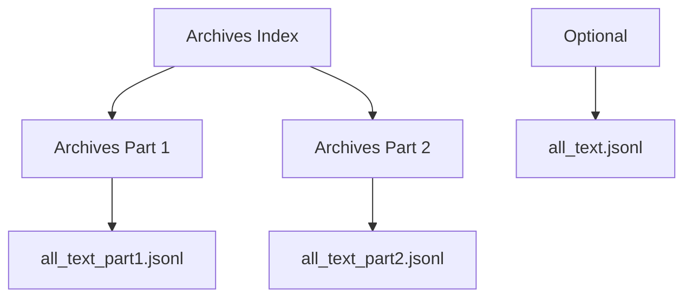

## 1. Product Overview
Create a dedicated archives section on the Symbi website that provides LLM-readable access to text data through streaming JSONL files. The archives serve as a data repository with minimal Symbi branding, designed primarily for machine consumption rather than human readability.

## 2. Core Features

### 2.1 User Roles
| Role | Access Method | Permissions |
|------|---------------|-------------|
| LLM/Automated Systems | Direct URL access | Read all archive data |
| Human Users | Browser navigation | Browse archive index and view data streams |

### 2.2 Feature Module
The archives section consists of the following pages:
1. **Archives index page**: Central navigation hub linking to both archive parts
2. **Part 1 archive page**: Streams content from all_text_part1.jsonl
3. **Part 2 archive page**: Streams content from all_text_part2.jsonl
4. **JSONL data files**: Raw text data accessible for direct consumption

### 2.3 Page Details
| Page Name | Module Name | Feature description |
|-----------|-------------|---------------------|
| Archives Index | Navigation Links | Display links to Part 1 and Part 2 archive pages with clear Symbi branding |
| Archives Part 1 | JSONL Stream Viewer | Stream and display contents of all_text_part1.jsonl with minimal formatting |
| Archives Part 2 | JSONL Stream Viewer | Stream and display contents of all_text_part2.jsonl with minimal formatting |

## 3. Core Process
User accesses archives through the following flow:
1. Navigate to /public/archives/index.html
2. Select either Part 1 or Part 2 archive link
3. View streaming JSONL data on selected part page
4. Optional: Direct access to JSONL files for programmatic consumption

## 4. User Interface Design

### 4.1 Design Style
- **Colors**: Symbi brand colors (monochrome palette with accent)
- **Typography**: System fonts for maximum compatibility
- **Layout**: Minimal, content-focused design
- **Styling**: Bare minimum CSS for structure only

### 4.2 Page Design Overview
| Page Name | Module Name | UI Elements |
|-----------|-------------|-------------|
| Archives Index | Navigation | Simple list of links, Symbi header/footer, monochrome color scheme |
| Archive Parts | JSONL Display | Pre-formatted text output, minimal styling, streaming indicator |

### 4.3 Responsiveness
Desktop-first design with basic mobile compatibility. Pages optimized for machine readability over human aesthetics.

### 4.4 Technical Implementation Notes
- JSONL streaming implementation for large file handling
- Minimal JavaScript for progressive loading
- Direct file access endpoints for programmatic consumption