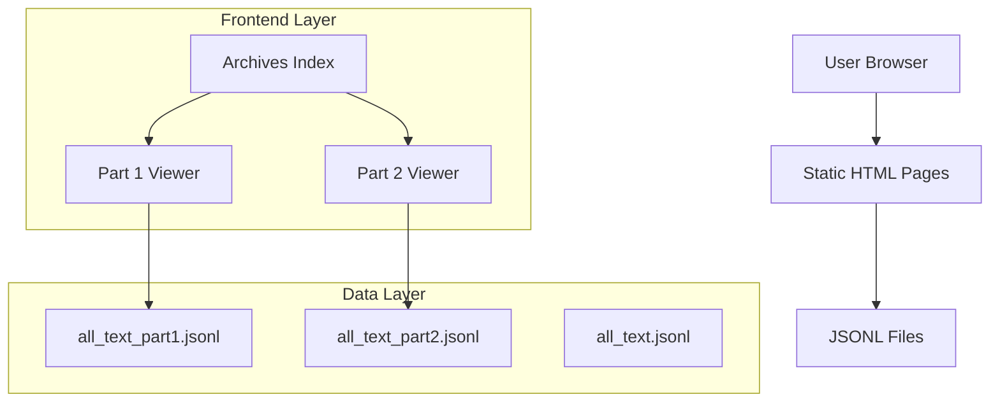

## 1. Architecture design



## 2. Technology Description
- Frontend: Static HTML + Vanilla JavaScript
- Initialization Tool: None (static files)
- Backend: None (static hosting)
- Data Format: JSONL (JSON Lines)

## 3. Route definitions
| Route | Purpose |
|-------|---------|
| /public/archives/index.html | Archives navigation hub |
| /public/archives/archives-part1.html | Part 1 JSONL stream viewer |
| /public/archives/archives-part2.html | Part 2 JSONL stream viewer |
| /public/archives/all_text_part1.jsonl | Raw Part 1 data file |
| /public/archives/all_text_part2.jsonl | Raw Part 2 data file |
| /public/archives/all_text.jsonl | Optional combined data file |

## 4. API definitions
No backend API required. Direct file access through HTTP GET requests.

## 5. Server architecture diagram
Static file hosting only - no server-side processing required.

## 6. Data model

### 6.1 Data model definition
JSONL format with text entries:
```
{"text": "content here", "metadata": {...}}
{"text": "more content", "metadata": {...}}
```

### 6.2 File Structure
- all_text_part1.jsonl: First portion of text data
- all_text_part2.jsonl: Second portion of text data  
- all_text.jsonl: Optional combined single file

### 6.3 Implementation Notes
- Files served with appropriate MIME types
- Streaming support for large file handling
- Progressive loading for improved performance